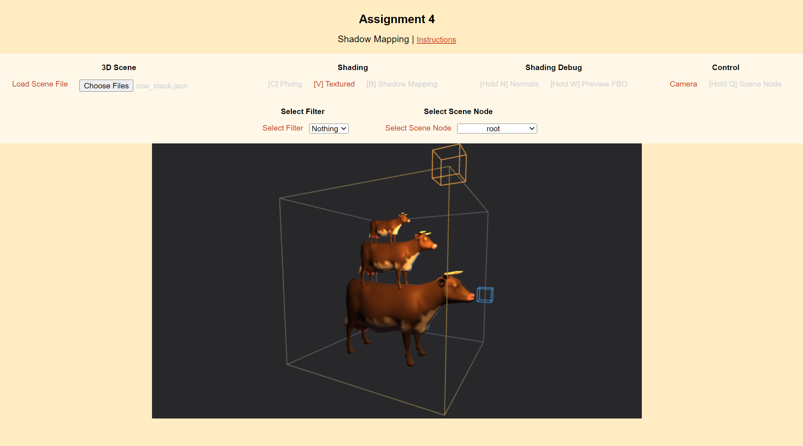

# ECS 175 - Final Project

## Project Images


## Hosting and running the project
The assignment is a simple HTML+JS website with minimal dependencies. To run it we recommend using one of the following methods. You are free to use alternative means to host the site. Before submitting, make sure it works with either of the methods shown here as there could be slight differences in how the web servers handle paths and file loading.

### Using Python
If you have python installed on your system you can use the built-in HTTP Server that ships with it to host the project.

*Windows & Linux*
```bash
cd /path/to/the/project
python -m http.server
```

*macOS*
```bash
cd /path/to/the/project
python3 -m http.server
```

## Using VSCode Plugin
There is a convenient plugin for VSCode that lets you host the current working directory as a website. Download and install the plugin from the VSCode marketplace:
[https://marketplace.visualstudio.com/items?itemName=ritwickdey.LiveServer](https://marketplace.visualstudio.com/items?itemName=ritwickdey.LiveServer)
